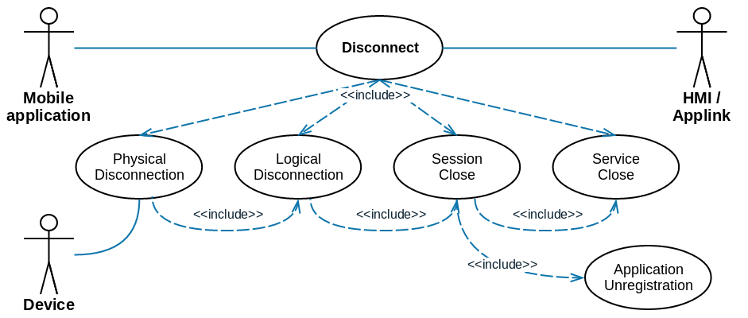
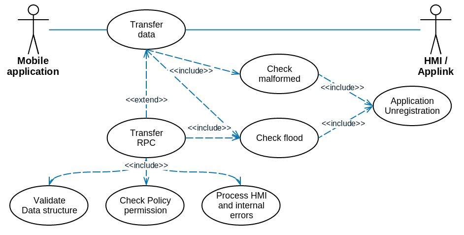
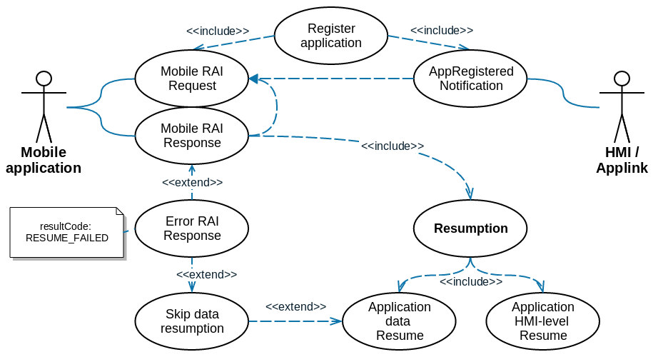

## 2.  Case Background

### 2.1. System Context, Mission and Scope

SmartDeviceLink system is developed to serve as a proxy between vehicle Head Unit sub-system and an Application that runs at any of compatible Mobile Devices:

-   A Mobile Device might be connected via USB, Bluetooth or Wi-Fi to the HU;
-   The Application should be the SDL-enabled one.

The Mobile Device might be any of:
-   Smartphone devices
-   Tablet PCs

with operational system:
-   iOS
-   Android.

The SDL system allows Application to:
-   Use vehicle HMI: VR, TTS, buttons (physical and touch-screen), vehicle display, audio system. etc.
-   Retrieve Vehicle Data (seat belt position, transmission shift lever position, airbag status, etc.).

The following Use Case diagrams show the actors, the processes and their interactions within SDL System.

#### Overview Use Case Diagram

#### Disconnect Use Case diagram

#### Connection Use Case diagram

#### Service data transferring Use Case diagram

#### Encryption Use Case diagram

#### Data verification Use Case diagram

#### RPC Use Case diagram

#### Mobile to HMI RPC processing Use Case diagram

#### HMI to Mobile RPC processing Use Case diagram

#### Resumption Use Case diagram

#### Application data resumption Use Case diagram

#### HMI level resumption Use Case diagram

### 2.2. Product Stakeholders

Actors are stakeholders that interact with product directly.
|| Stakeholder Name       || Actor (Yes/No) || Concern ||
| Ford Company             | No             | Get the SDL system with enough quality and functionality that fulfill their goals |
| PM / Architect / Analyst | No             | Use Customer Requirements Specification |
| Developers               | Yes            | Construct and deploy the system from specifications |
| Testers                  | No             | Test the system to ensure that it is suitable for use |

### 2.3. Business Goals

Luxoft delivered to Ford a prototype of POSIX compliant Applink Core in March, 2013.
To support FORD goal of successful acceptance of Applink (new name is SmartDeviceLink) Core by open source community of GENIVI consortium further enhancements will be required. The purpose of the project is to develop component of SmartDeviceLink 4.x Core by adding new features required by Ford.

### 2.4. Significant Driving Requirements

The requirements are listed in the table below and ordered by descending of their significance from architectural solution point of view.

| \# | **Driving Requirement Description** |
|----|-------------------------------------|
| 1. | System has to be POSIX-compliant to be easily ported on all POSIX standardized OSs. |
| 2. | Transport for communication between Mobile Application and SDL system must be implemented and easily changed, replaced or added if required |
| 3. | APIs for communication between Mobile Application and SDL system described in appropriate documents have to be fully supported by the system. |
| 4. | There has to be relatively easy way to port existing HMI Modules (such as UI, VR, TTS, etc.) to work with SDL system. |
| 5. | APIs for communication between SDL system and HMI Modules have to be fully described in appropriate document and fully supported by SDL system. |
